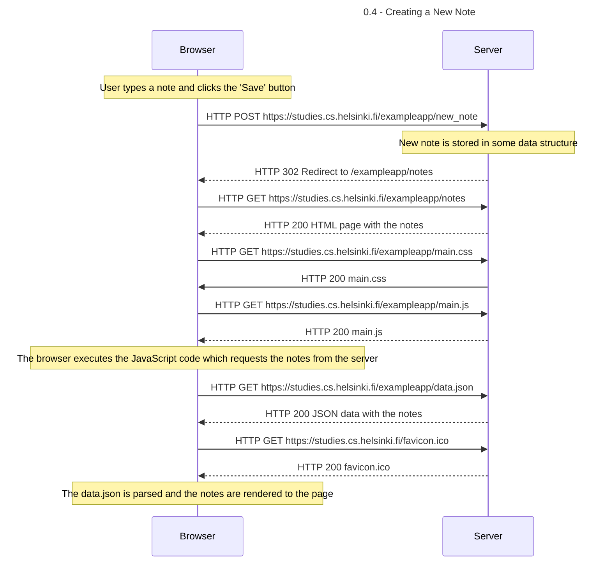

```mermaid
sequenceDiagram

    title: 0.4 - Creating a New Note

    participant Browser
    participant Server

    note over Browser: User types a note and clicks the 'Save' button
    Browser ->> Server: HTTP POST https://studies.cs.helsinki.fi/exampleapp/new_note
    note over Server: New note is stored in some data structure
    Server -->> Browser: HTTP 302 Redirect to /exampleapp/notes

    Browser ->> Server: HTTP GET https://studies.cs.helsinki.fi/exampleapp/notes
    Server -->> Browser: HTTP 200 HTML page with the notes

    Browser ->> Server: HTTP GET https://studies.cs.helsinki.fi/exampleapp/main.css
    Server ->> Browser: HTTP 200 main.css

    Browser ->> Server: HTTP GET https://studies.cs.helsinki.fi/exampleapp/main.js
    Server -->> Browser: HTTP 200 main.js

    note over Browser: The browser executes the JavaScript code which requests the notes from the server

    Browser ->> Server: HTTP GET https://studies.cs.helsinki.fi/exampleapp/data.json
    Server -->> Browser: HTTP 200 JSON data with the notes

    Browser ->> Server: HTTP GET https://studies.cs.helsinki.fi/favicon.ico
    Server -->> Browser: HTTP 200 favicon.ico

    note over Browser: The data.json is parsed and the notes are rendered to the page  
```

    