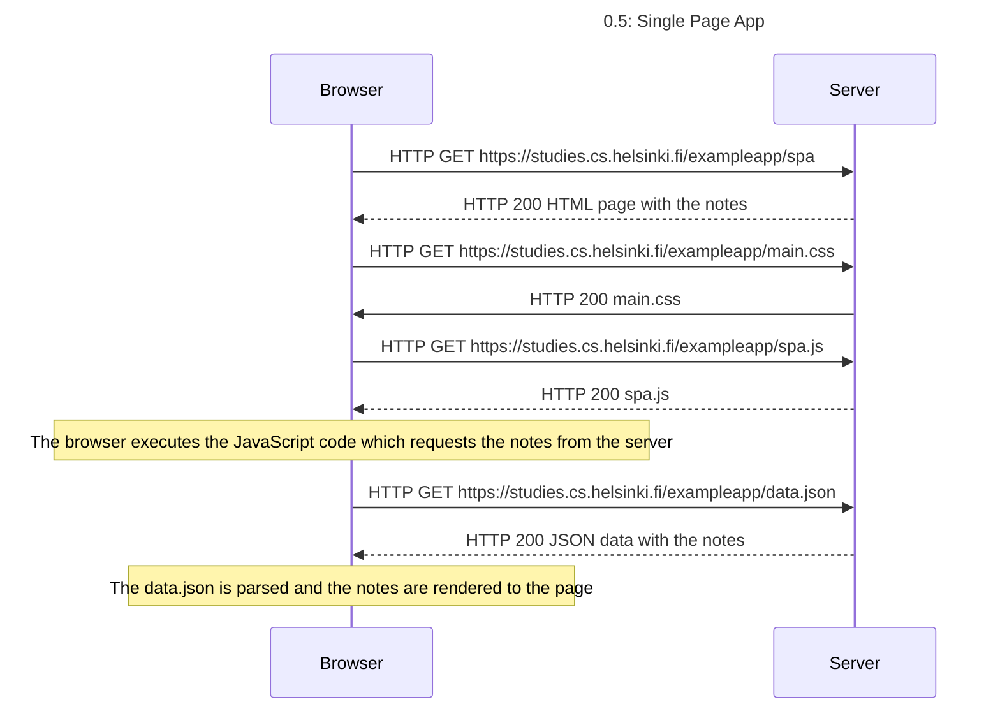

```mermaid

sequenceDiagram

    title: 0.5: Single Page App

    participant Browser
    participant Server

    Browser ->> Server: HTTP GET https://studies.cs.helsinki.fi/exampleapp/spa
    Server -->> Browser: HTTP 200 HTML page with the notes

    Browser ->> Server: HTTP GET https://studies.cs.helsinki.fi/exampleapp/main.css
    Server ->> Browser: HTTP 200 main.css

    Browser ->> Server: HTTP GET https://studies.cs.helsinki.fi/exampleapp/spa.js
    Server -->> Browser: HTTP 200 spa.js

    note over Browser: The browser executes the JavaScript code which requests the notes from the server

    Browser ->> Server: HTTP GET https://studies.cs.helsinki.fi/exampleapp/data.json
    Server -->> Browser: HTTP 200 JSON data with the notes

    note over Browser: The data.json is parsed and the notes are rendered to the page

    

```