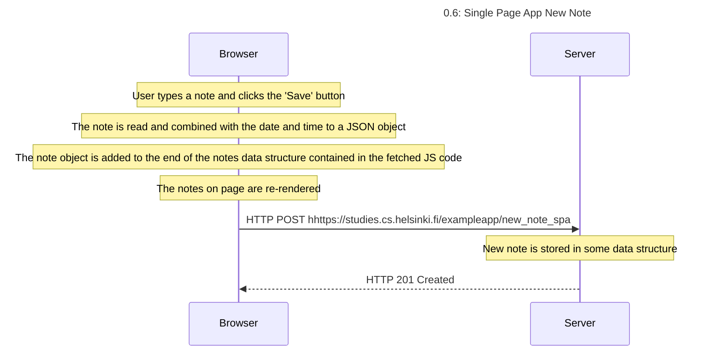

```mermaid

sequenceDiagram

    title: 0.6: Single Page App New Note

    participant Browser
    participant Server

    note over Browser: User types a note and clicks the 'Save' button

    note over Browser: The note is read and combined with the date and time to a JSON object

    note over Browser: The note object is added to the end of the notes data structure contained in the fetched JS code

    note over Browser: The notes on page are re-rendered

    Browser ->> Server: HTTP POST hhttps://studies.cs.helsinki.fi/exampleapp/new_note_spa
    note over Server: New note is stored in some data structure
    Server -->> Browser: HTTP 201 Created


```